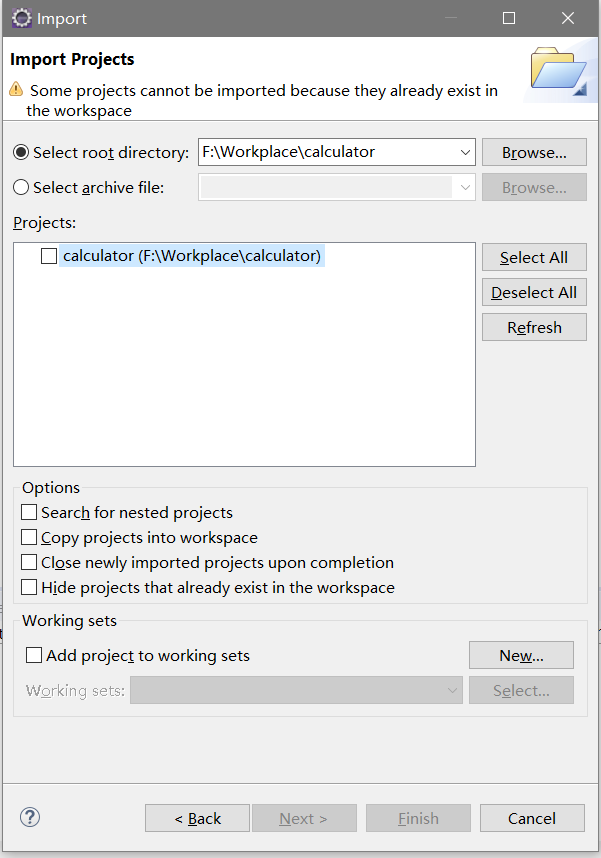

# 1. 计算器JavaSwing(简易)
极简的计算器，运用了栈的知识能够处理混合运算
# 2. 环境
eclipse2019.03+JavaSE1.8
# 3. 使用到的框架
无
# 4. 安装指南
- 先从GitHub上git clone下
-  然后打开eclipse导入项目
 
 
- 右键项目就可以看到运行效果

# 5. 运行效果

# 6. 注意事项
- 程序中对于左右括号的识别有问题,一般情况下有左右括号运行效果不是很好
- 支持算法优先级(栈知识)
